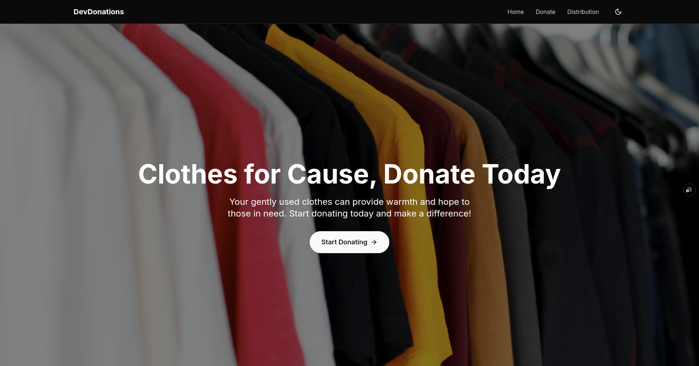

# DevDonations 🌟

[](https://devdonation.vercel.app/)
[](https://opensource.org/licenses/MIT)
[](https://github.com/shivamksharma/DevDonations/releases)

DevDonations is a full-stack platform connecting donors with developers in need through clothing donations. Our mission is to bridge the gap between surplus resources and community needs using modern web technologies.

## 🚀 Live Demo

Experience the platform live: [https://devdonation.vercel.app/](https://devdonation.vercel.app/)



## ✨ Features

### Core Functionality
- **Donation Management**
  - Multi-step donation form with validation
  - Flexible pickup/dropoff scheduling
  - Real-time donation tracking
- **Volunteer System**
  - Volunteer application processing
  - Task assignment & tracking

### Technical Highlights
- Responsive UI with smooth animations
- Secure Firebase authentication
- Zustand state management
- Recharts-powered analytics
- Form validation with Zod & React Hook Form

## 📦 Installation & Setup

1. Clone the repository:
   ```bash
   git clone https://github.com/shivamksharma/DevDonations.git
   cd DevDonations
   ```

2. Install dependencies:
   ```bash
   npm install
   ```

3. Set up Firebase:
   - Create a Firebase project at [https://console.firebase.google.com/](https://console.firebase.google.com/)
   - Enable Authentication with Email/Password and Google providers
   - Enable Firestore Database
   - Enable Storage (if needed for file uploads)
   - Copy your Firebase config to `.env.local`:
     ```
     NEXT_PUBLIC_FIREBASE_API_KEY=your_api_key
     NEXT_PUBLIC_FIREBASE_AUTH_DOMAIN=your_project.firebaseapp.com
     NEXT_PUBLIC_FIREBASE_PROJECT_ID=your_project_id
     NEXT_PUBLIC_FIREBASE_STORAGE_BUCKET=your_project.appspot.com
     NEXT_PUBLIC_FIREBASE_MESSAGING_SENDER_ID=your_sender_id
     NEXT_PUBLIC_FIREBASE_APP_ID=your_app_id
     ```

4. Deploy Firestore Security Rules:
   - Copy the rules from `firestore.rules` to your Firebase project
   - Update the admin email addresses in the security rules

5. Run the development server:
   ```bash
   npm run dev
   ```

## 🔐 Firebase Security

The application uses Firebase Authentication for admin access and Firestore security rules to protect sensitive data:

- **Public Access**: Donation creation, event viewing, blog posts
- **Admin Only**: User management, sensitive operations, analytics
- **Real-time Updates**: Live data synchronization across the application

## 🏗️ Architecture

- **Frontend**: Next.js 13+ with App Router
- **Authentication**: Firebase Auth with protected routes
- **Database**: Firestore with real-time subscriptions
- **State Management**: Zustand + custom hooks
- **UI Components**: ShadCN/UI with Tailwind CSS
- **Forms**: React Hook Form with Zod validation

4. Open your browser at `http://localhost:3000`.

## ⚙️ Configuration

Ensure to set up environment variables in a `.env.local` file for:
- Database connection
- API keys
- Authentication secrets

## 🤝 Contributing

Contributions are welcome! Follow these steps:

1. Fork the repository.
2. Create a new branch:
   ```bash
   git checkout -b feature-name
   ```
3. Commit your changes:
   ```bash
   git commit -m "Add some feature"
   ```
4. Push to your branch:
   ```bash
   git push origin feature-name
   ```
5. Open a pull request.

## 📄 License

This project is licensed under the MIT License. See the [LICENSE](LICENSE) file for details.

## 💬 Contact

For questions or feedback:
- **Email**: [your-email@example.com](mailto:your-email@example.com)
- **GitHub**: [shivamksharma](https://github.com/shivamksharma)

---

Built with ❤️ by [Shivam Sharma](https://github.com/shivamksharma).

